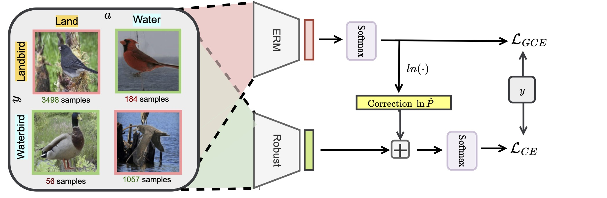

##  Avoiding spurious correlations via logit correction
This repository provides the official PyTorch implementation of the following paper:
> Avoiding spurious correlations via logit correction <br>
> [Sheng Liu](https://shengliu66.github.io/) (NYU),  Xu Zhang (Amazon), Nitesh Sekhar (Amazon), Yue Wu (Amazon), Prateek Singhal (Amazon), Carlos Fernandez-Granda (NYU)
>  ICLR 2023<br>

> Paper: [Arxiv](https://arxiv.org/abs/2212.01433) <br>

**Abstract:** 
*Empirical studies suggest that machine learning models trained with empirical risk minimization (ERM) often rely on attributes that may be spuriously correlated with the class labels. Such models typically lead to poor performance during inference for data lacking such correlations. In this work, we explicitly consider a situation where potential spurious correlations are present in the majority of training data. In contrast with existing approaches, which use the ERM model outputs to detect the samples without spurious correlations and either heuristically upweight or upsample those samples, we propose the logit correction (LC) loss, a simple yet effective improvement on the softmax cross-entropy loss, to correct the sample logit. We demonstrate that minimizing the LC loss is equivalent to maximizing the group-balanced accuracy, so the proposed LC could mitigate the negative impacts of spurious correlations. Our extensive experimental results further reveal that the proposed LC loss outperforms state-of-the-art solutions on multiple popular benchmarks by a large margin, an average 5.5\% absolute improvement, without access to spurious attribute labels. LC is also competitive with oracle methods that make use of the attribute labels.*<br>

<p align="center">
  
</p>

## Pytorch Implementation
### Installation
Clone this repository.
```
git clone --recursive https://github.com/shengliu66/LC-private
cd Logit-Correction
pip install -r requirements.txt
```
### Datasets
- **Waterbirds:** Download waterbirds from [here](https://nlp.stanford.edu/data/dro/waterbird_complete95_forest2water2.tar.gz).
- In that directory, our code expects `data/waterbird_complete95_forest2water2/` with `metadata.csv` inside.
- Specify `--data_dir` 

- **CivilComments:** Download civilcomments dataset from [here (https://worksheets.codalab.org/rest/bundles/0x8cd3de0634154aeaad2ee6eb96723c6e/contents/blob/) 
- In that directory, our code expects a folder `data` with the downloaded dataset.
- Specify `--data_dir` 

### Running LC 
#### Waterbird 
```
python train.py --dataset waterbird --exp=waterbird_ours --lr=1e-3 --weight_decay=1e-4 --curr_epoch=50 --lr_decay_epoch 50 --use_lr_decay --lambda_dis_align=2.0 --ema_alpha 0.5 --tau 0.1 --train_ours --q 0.8 --avg_type batch --data_dir /dir/to/data/
```
#### CivilComments 
```
python train.py --dataset civilcomments --exp=civilcomments_ours --lr=1e-5 --q 0.7 --log_freq 400 --valid_freq 400 --weight_decay=1e-2 --curr_step 400 --use_lr_decay --num_epochs 3 --lr_decay_step 4000 --lambda_dis_align=0.1 --ema_alpha 0.9 --tau 1.0 --avg_type mv_batch --train_ours --data_dir /dir/to/data/
```

## Monitoring Performance
We use [Weights & Biases](https://wandb.ai/site) to monitor training, you can follow the [doc](https://docs.wandb.ai/quickstart) here to install and log in to W&B, and add the argument `--wandb` . 


### Evaluate Models
In order to test our pretrained models, run the following command.
```
python test.py --pretrained_path=<path_to_pretrained_ckpt> --dataset=<dataset_to_test> 
```

### Citations

### BibTeX
```bibtex
@Inproceedings{
Liu2023, 
author = {Sheng Liu and Xu Zhang and Nitesh Sekhar and Yue Wu and Prateek Singhal and Carlos Fernandez-Granda}, 
title = {Avoiding spurious correlations via logit correction}, 
year = {2023}, 
url = {https://www.amazon.science/publications/avoiding-spurious-correlations-via-logit-correction}, 
booktitle = {ICLR 2023}, 
}
```

### Contact
Sheng Liu (shengliu@nyu.edu)

### Acknowledgments
This work was mainly done the authors was doing internship at Amazon Science. 
Our pytorch implementation is based on [Disentangled](https://github.com/kakaoenterprise/Learning-Debiased-Disentangled).
We would like to thank for the authors for making their code public.
