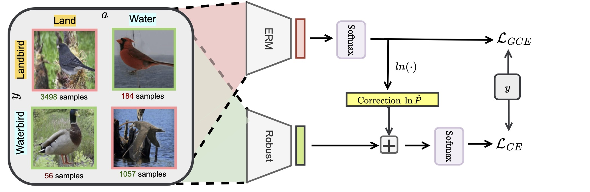

##  Avoiding spurious correlations via logit correction
This repository provides the official PyTorch implementation of the core algorithms (including logit correction and groupMixUp) in the following paper:
> Avoiding spurious correlations via logit correction <br>
> [Sheng Liu](https://shengliu66.github.io/) (NYU),  Xu Zhang (Amazon), Nitesh Sekhar (Amazon), Yue Wu (Amazon), Prateek Singhal (Amazon), Carlos Fernandez-Granda (NYU)
>  ICLR 2023<br>

> Paper: [Arxiv](https://arxiv.org/abs/2212.01433) <br>

**Abstract:** 
*Empirical studies suggest that machine learning models trained with empirical risk minimization (ERM) often rely on attributes that may be spuriously correlated with the class labels. Such models typically lead to poor performance during inference for data lacking such correlations. In this work, we explicitly consider a situation where potential spurious correlations are present in the majority of training data. In contrast with existing approaches, which use the ERM model outputs to detect the samples without spurious correlations and either heuristically upweight or upsample those samples, we propose the logit correction (LC) loss, a simple yet effective improvement on the softmax cross-entropy loss, to correct the sample logit. We demonstrate that minimizing the LC loss is equivalent to maximizing the group-balanced accuracy, so the proposed LC could mitigate the negative impacts of spurious correlations. Our extensive experimental results further reveal that the proposed LC loss outperforms state-of-the-art solutions on multiple popular benchmarks by a large margin, an average 5.5% absolute improvement, without access to spurious attribute labels. LC is also competitive with oracle methods that make use of the attribute labels.*<br>

<p align="center">
  
</p>

For a full E2E training and evaluation example, please refer to [link](https://github.com/shengliu66/LC)

## Citations

Please cite our paper if you find it to be helpful in your research. 

### BibTeX
```bibtex
@Inproceedings{
Liu2023, 
author = {Sheng Liu and Xu Zhang and Nitesh Sekhar and Yue Wu and Prateek Singhal and Carlos Fernandez-Granda}, 
title = {Avoiding spurious correlations via logit correction}, 
year = {2023}, 
url = {https://www.amazon.science/publications/avoiding-spurious-correlations-via-logit-correction}, 
booktitle = {ICLR 2023}, 
}
```

## Contact
Sheng Liu (shengliu@nyu.edu), Xu Zhang (xzhnamz@amazon.com)

## Acknowledgments
This work was mainly done the authors was doing internship at Amazon Science. 
